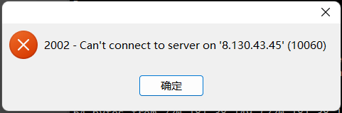
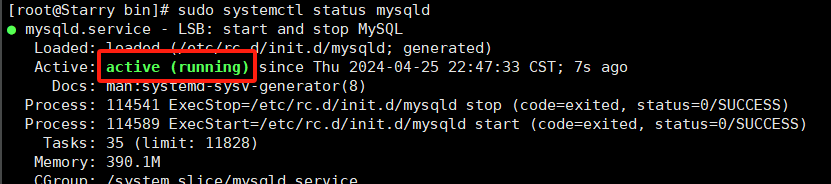
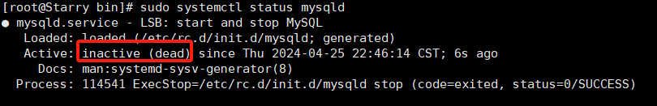
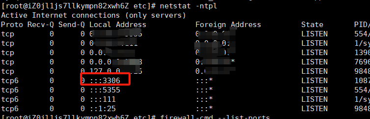
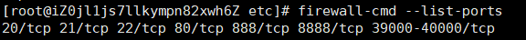
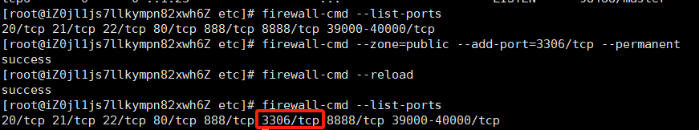
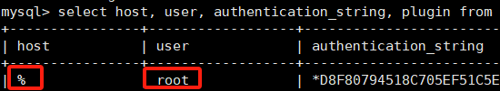

# navicat远程连接服务器、虚拟机上mysql提示错误10060


错误提示：



# 报错的可能原因：

1.网络问题

2.sql服务未启动

3.端口未被监听

4.防火墙未开放对应端口

5.mysql没有远程权限

# 解决方案：

## 1.网络问题

网络测试：

```
ping www.baidu.com
```

关于网络配置可参考往期文章：http://t.csdnimg.cn/UEieu

## 2.mysql服务未启动

2.1 使用指令

```
sudo systemctl status mysqld
```

输出如图：

启动中：



未启动：



相关启动停止指令：

```
#启动服务
sudo systemctl start mysqld 
#终止服务
sudo systemctl stop mysqld 
#重启
sudo systemctl restart mysqld
```

## 3.端口未被监听

确保使用的是 MySQL默认的 3306 端口。运行命令：

```
netstat -ntpl
```

如图则表示mysql正在监听3306端口



## 4.防火墙未开放对应端口

检查防火墙设置，确保 MySQL 端口（默认为 3306）未被阻止。运行命令：

```
firewall-cmd --list-ports
```

如图发现没有3306/tcp，则表示3306端口未开放



可以使用一下命名开放3306端口：

```
firewall-cmd --zone=public --add-port=3306/tcp --permanent
firewall-cmd --reload
```

然后再输入检查命令，如图即成功：



## 5.mysql没有远程权限

查看当前root用户的相关信息

```
#登录mysql
mysql -u root -p;
#选择mysql数据库
use mysql;
#查看user表
select host, user, authentication_string, plugin from user; 
```

如下图，如果root用户的host是"localhost"则标识只允许本地访问；

"%"则表示授予 root 用户从任何主机中的所有权限



相关命令：

如果是mysql8.0之前的版本

```
#进入MySQL数据库后进入MySQL数据库。
mysql -u root -p; 
#切换到 mysql 数据库。
mysql> use mysql;
#授予 root 用户从任何主机中的所有权限，并设置密码。
mysql> grant all privilegs on *.* to 'root'@'%' identified by 'root用户密码' with grant option;
#刷新权限
mysql> flush privileges;
```

mysql8.0以上版本

```
#进入MySQL数据库后进入MySQL数据库。
mysql -u root -p ;
#将 root 用户的主机设置为任意主机
mysql> update user set host = '%' where user = 'root';
#刷新权限
mysql> flush privileges;
```

