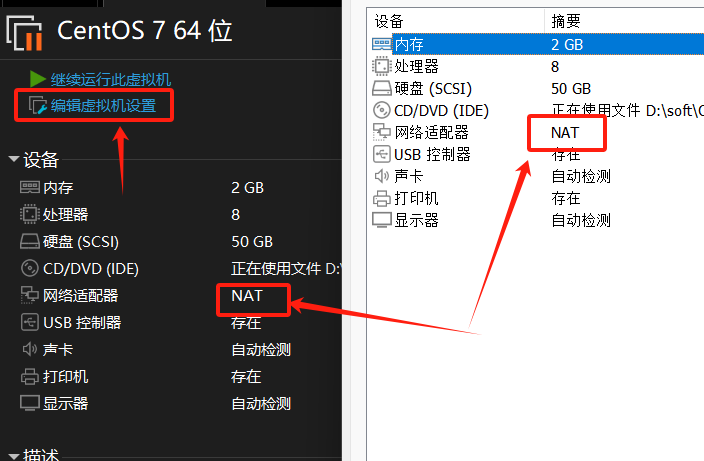
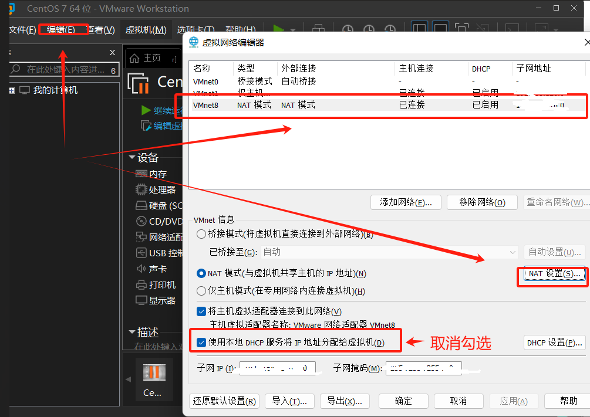
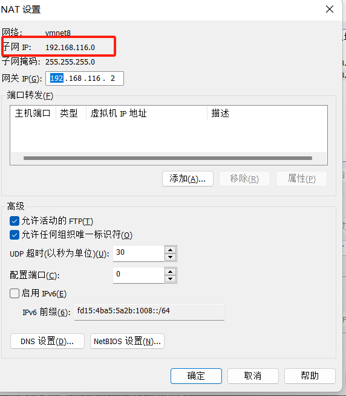
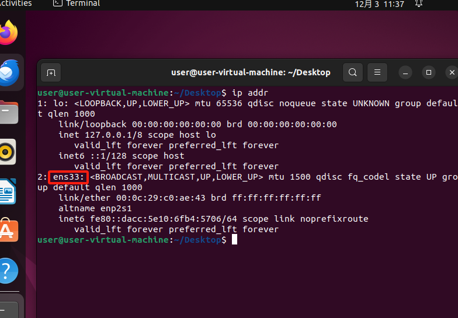
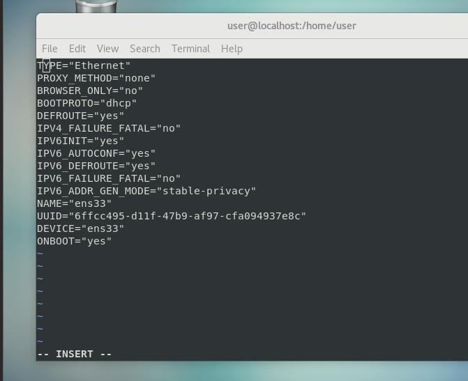
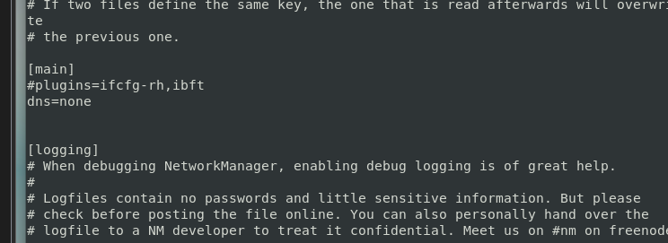
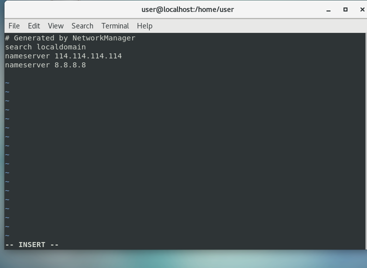
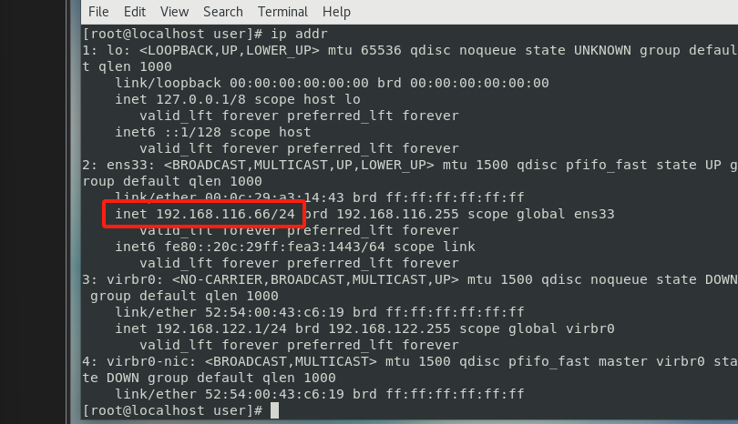
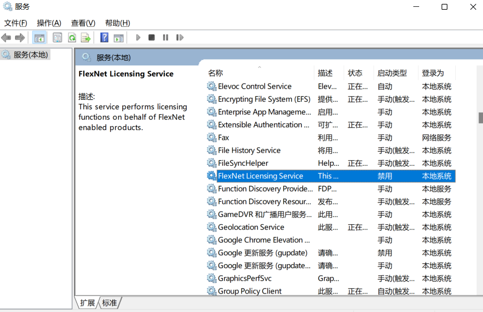

# 使用Xshell远程连接Linux服务器

# 1.Linux网络类型

| 网络类型                    | 中文                                 | 描述                                                         |
| --------------------------- | ------------------------------------ | ------------------------------------------------------------ |
| Bridge                      | 桥接模式(Xshell和主机各有一个IP地址) | 该模式下虚拟机与主机地位平等，相当于在同一局域网中添加了一 台新的独立主机<br />该模式要求虚拟机和主机在同一网段，且虚拟机要占据局域网中的 一个IP地址<br />同一网段中，无论是虚拟机还是真实主机，互相之间都可以访问， 也可以访问外网 |
| Network Address Translation | NAT模式(Xshell和主机共享IP地址)      | 该模式下虚拟机可以通过主机访问外网，无需进行额外配置即可轻 松访问互联网<br />该模式会生成一个非主机范围IP地址，而不占用原来的IP地址<br />该模式下虚拟机可以通过主机访问外网，但无法访问局域网内的其 他主机或虚拟机 |
| Host-Only                   | 仅主机模式(Xshell只能与主机进行通信) | 该模式可理解为虚拟机是一个不能访问外网的独立主机，即是一个 单机模式的虚拟机<br />该模式下所有的虚拟系统之间是可以相互通信的，但虚拟系统和真 实的网络是被隔离开的 |


# 2.Xshell连接虚拟机

## 2.1首先查看虚拟机设置的网络连接是否为NAT模式




## 2.2查看ip地址

点击VMware左上角“编辑”-->“虚拟网络编辑器”，点击NAT模式后，点击NAT设置，记住子网掩码、网关IP。







## 2.3配置虚拟机IP地址

1.输入：

```
ip addr
获取这个ensxxxxx(注意：xxxx是以连串数字，每台虚拟机实力不一样，这个值就不一样,也可能是enoxxxx)
```




如果ens33下没有inet值，则说明网络配置还没有配置成功

2、修改ens33网卡的配置

在终端里输入：

```
vi /etc/sysconfig/network-scripts/ifcfg-ens33
```

 进入vim编辑器，然后按i进入编辑模式，按下图进行修改，修改完成后输入：wq，进行保存退出

修改前


修改后

```
# 修改: 静态IP模式: 默认的 `DHCP` 动态分配会每隔一段时间跳网，体验很差
BOOTPROTO=static
# 修改: 网络服务启动时自动分配IP，默认采用动态IP的方式
ONBOOT=yes
# 添加: 设置虚拟机IP，要求网段和子网IP一致，最后1位随意[3,255]，不要和网关冲突即可(0,1,2可能会有冲突)
IPADDR=192.168.116.66
# 添加: 设置虚拟机子网掩码地址
NETMASK=255.255.255.0
# 添加: 设置虚拟机网关IP地址
GATEWAY=192.168.116.2
# 添加: 关闭网络控制，即修改网卡配置后无需重启NetworkManager服务，只需重启NetWork服务即可
生效
NM_CONTROLLED=no
# 重启网络服务: 使ens32网卡的配置生效
systemctl restart network
```

## 2.4配置NetworkManager服务配置

鼠标往下移，找到main函数，在下面添加

```
# 配置NetworkManager服务配置
vi /etc/NetworkManager/NetworkManager.conf
[main]
# 添加: 禁止NetworkManager修改DNS数据
dns=none
# 重启NetworkManager服务: 使NetworkManager服务配置生效
systemctl restart NetworkManager
```



## 2.5修改DNS域名系统配置

- DNS是一个用来存储域名和对应真实IP的数据库。 
- 通过DNS服务就可以使用域名访问互联网。

```
vi /etc/resolv.conf
# 添加: 国内移动、电信和联通通用的DNS，是国内用户上网常用的DNS
nameserver 114.114.114.114
# 添加: GOOGLE公司提供的DNS，该地址是全球通用的，相对来说，更适合国外以及访问国外网站的用户使用。
nameserver 8.8.8.8
# 重启网络服务: 使DNS域名系统配置生效
systemctl restart network
```




## 2.6测试虚拟机网络是否连通外网

```
# 查看是否能ping同，使用 ctrl + c 结束
ping baidu.com
# 查看虚拟机的虚拟IP地址: 即ens33中的inet值
ip addr
```



如图显示，然后就成功了哦

# BUG汇总

## 1.打开xshell一直没反应，xshell打开失败的问题

​	解决：

1. `win+R`入CMD

​	2.在黑窗口输入：`services.msc`



3.找到Flash Helper Service以及FlexNet Licensing Service

- 将Flash Helper Service以及FlexNet Licensing Service启动类型改为禁用
- 并且将服务停止【不要忘记】
- 此时重新双击Xshell应该就可以启动了。